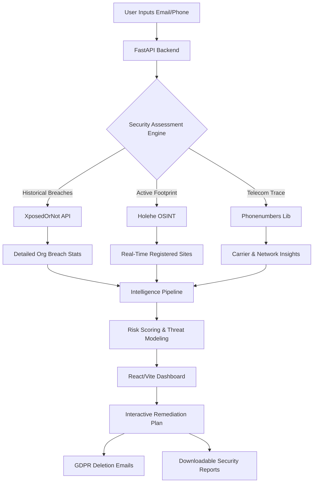

# DATAFENCE

## What is DATAFENCE?
**DATAFENCE** is an advanced Personal Data Exposure, Intelligence, and Adaptive Security Platform. It acts as a centralized intelligence engine that aggressively maps a user's digital footprint across the web. By analyzing historical breach data and predicting active account footprints, it empowers individuals to understand exactly where their personal data resides and provides automated, actionable steps to reclaim their digital privacy.

## Features
- **Real-Time Active OSINT Footprinting**: Actively checks password-recovery endpoints of 50+ popular services (Twitter, Spotify, Instagram, etc.) to discover live, active accounts linked to an email.
- **Historical Breach Analytics**: Integrates with security APIs to fetch specific breached organizations, exposed domains, and exact counts of compromised accounts.
- **Telecom Trace (Sanchar Saathi style)**: Analyzes phone numbers to determine regional data, carrier information, and maps connected digital apps.
- **Threat & Blast Radius Scoring**: An intelligent risk engine that correlates exposed data to determine potential identity inferences and the "blast radius" of compromised data.
- **Interactive Remediation Suite**: 
  - Dynamic step-by-step security checklist.
  - One-click **GDPR/CCPA Deletion Email** generator.
  - Direct secure links to vulnerable platforms.
  - Exportable PDF/Text Security Audit Reports.
- **Secure Authentication**: Fully secure JWT-based session management using SQLite and PBKDF2 hashing.

## Uses & Applications
- **Personal Privacy Audits**: Individuals can discover hidden digital footprints and clean up unused or vulnerable online accounts.
- **Breach Response & Recovery**: Instantly know if an email or phone number was caught in a recent data leak and take immediate action.
- **GDPR Enforcement**: Easily exercise the "Right to be Forgotten" by auto-generating legal deletion requests for compromised organizations.
- **Cybersecurity Awareness**: Educate users on their "Blast Radius" by showing how one leaked credential affects their entire digital identity.

## Tech Stack & Tools
- **Frontend**: React, Vite, Lucide-React (Icons), Vanilla CSS (Custom Hacker UI).
- **Backend**: Python, FastAPI, Uvicorn, Pydantic.
- **Database**: SQLite (Authentication & Sessions).
- **OSINT & Intelligence Tools**: 
  - `holehe` (Email OSINT module)
  - `phonenumbers` (Telecom module)
  - `XposedOrNot API` (Breach Analytics)
- **Containerization**: Docker & Docker Compose.

## System Model & Flow Chart
The platform operates using a multi-stage **Intelligence Pipeline Model** that correlates raw user inputs into structured security assessments.



## How to Deploy
This project is fully containerized with Docker. Hot-reloading is configured by default for both the frontend and backend to ensure a smooth development experience.

### Prerequisites
- Install [Docker](https://docs.docker.com/get-docker/) and [Docker Compose](https://docs.docker.com/compose/install/).

### Step-by-Step Deployment

1. **Clone the Repository**
   ```bash
   git clone https://github.com/Krish-cys/DATAFENCE-git.git
   cd DATAFENCE-git
   ```

2. **Run with Docker Compose**
   Build and start the application in detached mode:
   ```bash
   sudo docker compose up --build -d
   ```

3. **Access the Application**
   - **Frontend UI**: Open your browser and navigate to `http://localhost:5173`
   - **Backend API**: Running at `http://localhost:8000`
   - **API Documentation**: Interactive Swagger docs available at `http://localhost:8000/docs`

4. **Stopping the Application**
   ```bash
   sudo docker compose down
   ```